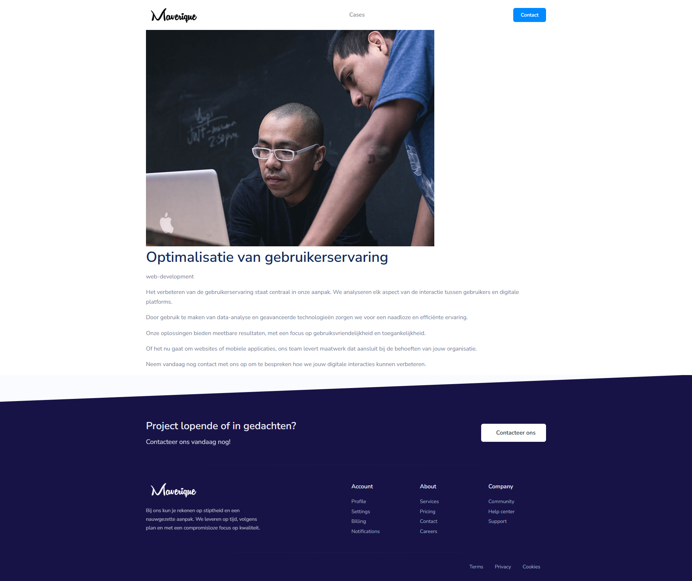

# Maverique-Digital-Cases-Platform

An interactive web application that showcases various digital service cases — from cloud integration to cybersecurity and app development. Users can browse, filter, and explore case studies, and reach out via a contact form.

> Built with Node.js, Express, Handlebars, and SQLite.

---

##  Preview



---

##  Features

-  Dynamic case listing with filters (based on tags)
-  Individual case detail pages via slug routing
-  Contact form with database-backed submissions
-  Informational sections rendered dynamically from server data
-  Fully templated using Handlebars with reusable partials

---

##  Technologies Used

| Tool/Library     | Purpose                          |
|------------------|----------------------------------|
| Node.js          | JavaScript runtime               |
| Express.js       | Web framework & routing          |
| Handlebars (HBS) | View templating engine           |
| SQLite           | Lightweight relational database  |
| Morgan           | HTTP request logging             |
| Bootstrap        | Styling and responsive layout    |
| Feather Icons    | UI icons                         |

---

##  Project Structure

```bash
.
├── app.js                  # Express app configuration
├── routes/                 # Route definitions (home, cases, contact)
├── views/                 
│   ├── cases/              # Case listing & detail views
│   ├── layouts/            # Main layout template
│   ├── partials/           # Navbar, footer, etc.
│   └── *.hbs               # Main page templates
├── scripts/
│   ├── 01-initial-create.js     # Creates & seeds `cases` table
│   └── 02-create-submissions.js # Creates `submissions` table
├── data/
│   └── cases.db            # SQLite database
├── public/
│   ├── images/             # Case-related visuals
│   ├── stylesheets/        # CSS styles
│   └── javascripts/        # Optional client-side scripts
├── .gitignore
├── package.json
└── README.md               # 📘 You are here
